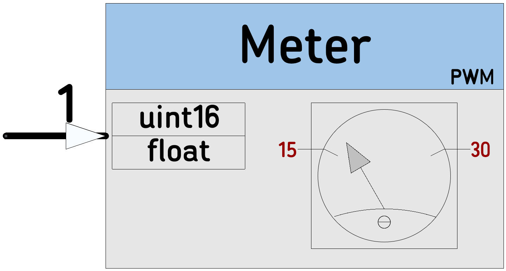

# [METER](https://github.com/nBlocksStudioNodes/nblocks_meter)

Drives a moving-coil meter with a PWM pin and optionally with a  transistor.

----

 

----

 

----

  *  Category: Function
  *  HAL: mbed
  *  Tested: LPC1768
  *  Author: N. Chalikias

## Inputs
 *  (Schematic pin1) value to be indicated, accepts 2 types:
    *  uint16_t
    *  float

## Parameters
 *  PinName: pinADC: ADC input pin
 *  PinName: pinPWM: PWM output pin
 *  float: VCC: Meter supply voltage
 *  float: inputVMAX: maximum input at the ADC input
 *  float: meterVMAX: Max Voltage for the moving coil meter
 *  float: Thermistor beta value
 *  uint32_t: Frequency: PWM signal frequency

## Example:

[Ticker]-->[Counter]-->[METER]
